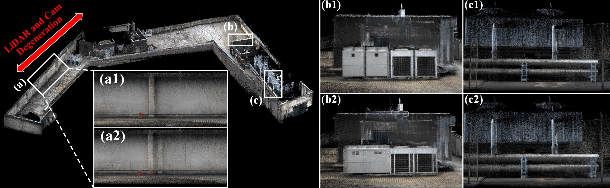
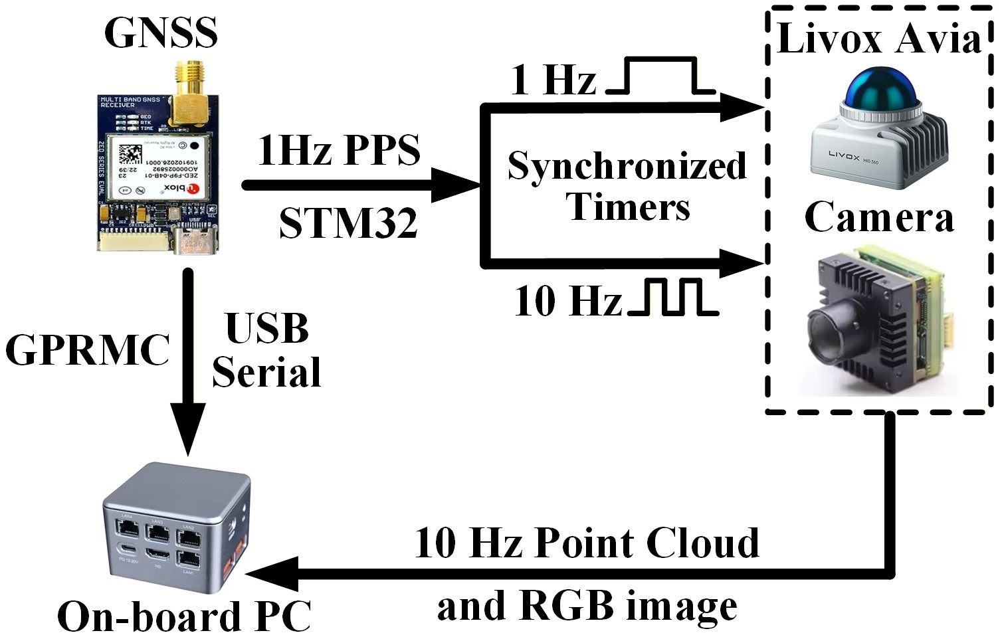
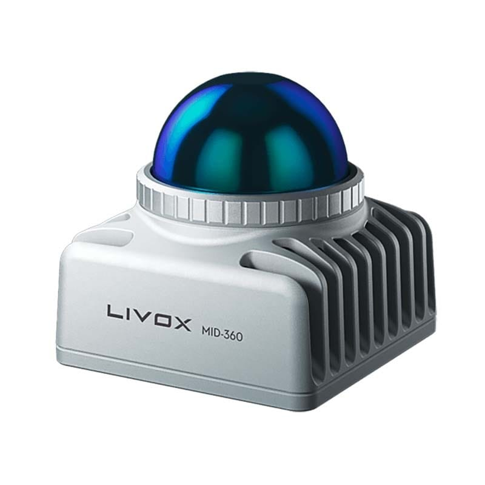
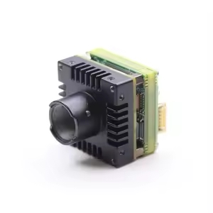
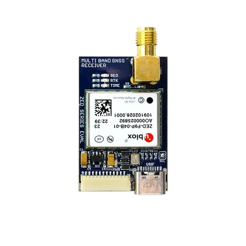
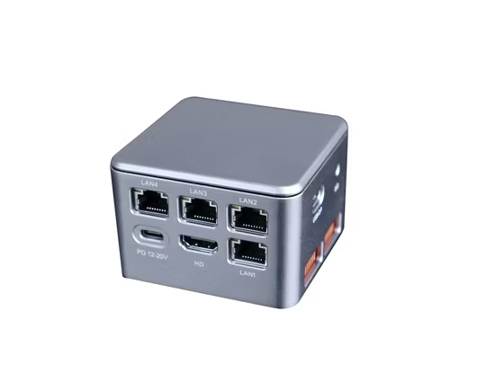
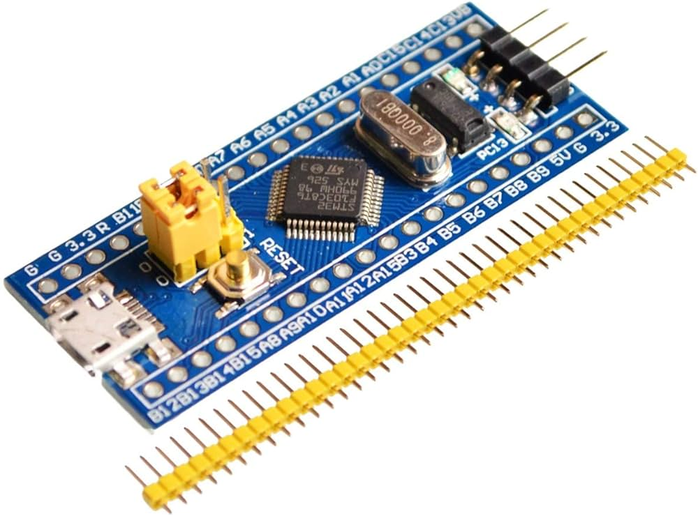

# FAST-LIVO2-RTK

FAST-LIVO2-RTK extends FAST-LIVO2 with RTK/GNSS-constrained global optimization for long-term LiDAR-visual mapping.

**Key highlights include:**

1. Fully Reproducible: Complete open-source software and hardware setup guaranteeing fully reproducible LIVO-RTK experiments.
2. Robust Initialization Module: Built-in initialization featuring DTW-based time offset estimation and hand-eye extrinsic calibration.
3. LIV-RTK Fusion Paradigm: A comprehensive example paradigm for fusing LIVO trajectories with RTK observations.

📬 For further assistance or inquiries, please feel free to contact Chunran Zheng at [zhengcr@connect.hku.hk](mailto:zhengcr@connect.hku.hk).

<div align="center">
  
  <br>
  <sub>Collected in a challenging scene with degraded geometry and texture.
<b>a2, b2, c2</b>: FAST-LIVO2 baseline. <b>a1, b1, c1</b>: results after RTK fusion.</sub>
</div>

## 1. Prerequisited

### 1.1 Ubuntu and ROS

Ubuntu 18.04~20.04. See [ROS Installation](http://wiki.ros.org/ROS/Installation).

### 1.2 PCL, Eigen, and OpenCV

PCL>=1.8, Eigen>=3.3.4, OpenCV>=4.2.

### 1.3 Sophus

Install the non-templated/double-only version of Sophus.

```bash
git clone https://github.com/strasdat/Sophus.git
cd Sophus
git checkout a621ff
mkdir build && cd build && cmake ..
make
sudo make install
```

### 1.4 Vikit

Vikit provides the camera models and math utilities required by this project. Put it in your catkin workspace source folder.

```bash
cd ~/catkin_ws/src
git clone https://github.com/xuankuzcr/rpg_vikit.git
```

### 1.5 RTK Dependencies

The RTK branch depends on the GNSS ROS message package used by the u-blox/GVINS toolchain. Put it in the same catkin workspace:

```bash
cd ~/catkin_ws/src
git clone https://github.com/HKUST-Aerial-Robotics/gnss_comm.git
```

GTSAM is used for factor graph-based post-processing optimization.

```bash
git clone https://github.com/borglab/gtsam.git
cd gtsam
mkdir build && cd build
cmake -DGTSAM_BUILD_WITH_MARCH_NATIVE=OFF -DGTSAM_USE_SYSTEM_EIGEN=ON ..
make -j$(nproc)
sudo make install
```

GeographicLib is used for converting geographic coordinates to local Cartesian coordinates.

```bash
sudo apt-get install libgeographic-dev ros-${ROS_DISTRO}-eigen-conversions
```

## 2. Run our examples

Download the provided RTK test rosbag file: [RTK-Dataset](https://drive.google.com/file/d/1RIRcqjaw3x8l-S-Dc655xHi_bKkI7q66/view?usp=sharing).

1. Launch the system and load the configuration file:

```bash
roslaunch fast_livo HH.launch
```

2. Play the rosbag. Once the sequence is finished, press `Enter` in the terminal running the launch file to trigger the backend optimizer.

```bash
rosbag play HH-LVGO-01.bag
```
## 3. Appendix
**Time Synchronization:**

The diagram illustrates the time synchronization scheme among GNSS, LiDAR, and image data.

<div align="center">
  
</div>

**Hardware Platform:**

The table below summarizes the main devices used by the platform.

<div align="center">
  <table align="center">
    <tr>
      <th>Device</th>
      <th>Image</th>
      <th>Model Description</th>
    </tr>
    <tr>
      <td align="center">LiDAR</td>
      <td align="center"></td>
      <td align="center">Model: Livox Mid-360</td>
    </tr>
    <tr>
      <td align="center">Camera</td>
      <td align="center"></td>
      <td align="center">Model: MV-CB016-10GC-S-W</td>
    </tr>
    <tr>
      <td align="center">GNSS Receiver</td>
      <td align="center"></td>
      <td align="center">Model: u-blox ZED-F9P</td>
    </tr>
    <tr>
      <td align="center">Computing Unit</td>
      <td align="center"></td>
      <td align="center">Model: N100 mini PC</td>
    </tr>
    <tr>
      <td align="center">Synchronization Controller</td>
      <td align="center"></td>
      <td align="center">Model: STM32</td>
    </tr>
  </table>
</div>

## 4. Acknowledgements

This repository is built on top of [FAST-LIVO2](https://github.com/hku-mars/FAST-LIVO2) and uses several open-source libraries and packages, including [GTSAM](https://github.com/borglab/gtsam), [GeographicLib](https://geographiclib.sourceforge.io/), and [gnss_comm](https://github.com/HKUST-Aerial-Robotics/gnss_comm).
